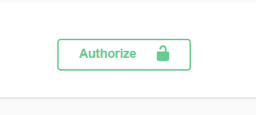
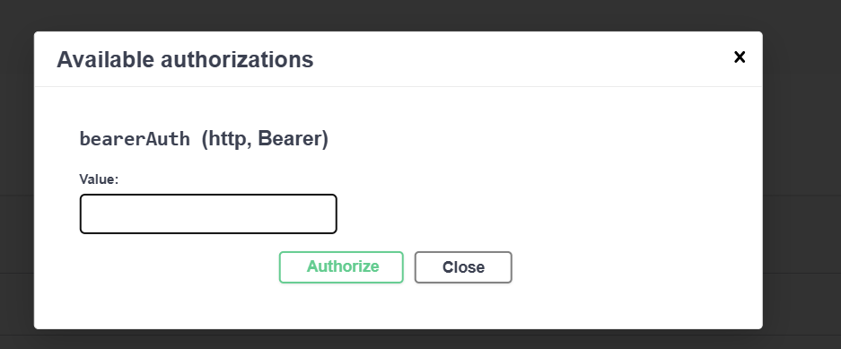

to access the swagger and all end points use localhost:8080/api/doc/ui

to use the access token in swagger

click the green button and add it her and log in

all the requests will be sent with the token inserted

you can also logout and insert a new token

there are two inserted users(username:password) by default -----> admin:admin and user:user
